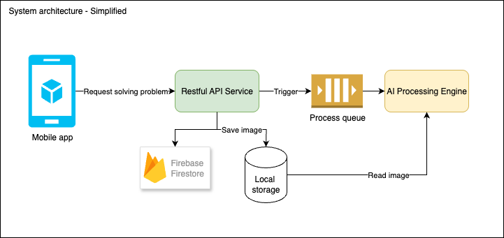

# Mini Solver Project Overview

Here I explain the Mini Solver project's guide, key architecture and design decisions, code structure, UI/UX choices, and the technologies used.

## Get Started

- Prerequisites: 
    
    - Docker and Docker Compose installed to run the backend.
    - Flutter SDK installed to run the frontend app.

- Steps:

1. Change the `.env.example` file in the `src/deployment` directory to `.env` and fill in the required environment variables, such as Firebase credentials and Gemini API keys.
2. Start the backend service by running `docker-compose up` in the `src/deployment` directory.
3. Change the `apiBaseUrl` in the `src/mini_solver_flutter/lib/configs/env.dart` file to match your local IP address in your LAN network. For example, if your local IP is `192.168.1.100`, you would set `apiBaseUrl` to `http://192.168.1.100:8000`.
4. Run the Flutter app on your device by running `flutter run --flavor dev -t lib/main_dev.dart`
   
   - For iOS, you may need to change the development team in the Xcode project settings. Open the project in Xcode, navigate to the "Signing & Capabilities" tab, and select your development team. If the application ID already exists, you can change to any unique ID, such as `com.mini_solver.app.test` (add `test` postfix to make it different)

Here I assume that you have basic knowledge of Docker, Flutter, and can run them on your local machine. If you encounter any issues, please refer to the official documentation for Docker and Flutter, or contact me directly for assistance at my email nguyenviethai819996@gmail.com.

## Secret keys:

The `.env` file, which contains GEMINI API Key, and the Firebase `service_account.json` file are secret and cannot be sent to 

## How to use the app

1. Register or login an account

    > Example test account: henry.test8@yopmail.com / Abc@12345

2. After login, the "Solve" screen is your home screen. Click the floating action button with a camera icon to capture the image of the question or problem you want to solve.
3. Once you captured, or picked an image from library, the app will send it to the backend for processing.
4. Once the results are ready, the app will display the solution and answer. The solution is visible by default for latest question, but the final answer is hidden - this allow you as a learner to try the solution yourself first instead of just see the result. Press "Show result" will reveal the final answer.

    > If the image contains no solvable problem, the app will inform you. If any error occurs, you can retry.
    
    > All of your requests while using the app is listed in that screen, with the latest one on top.

    > One image can have multiple problems in it. For each problem you can collapse the solution explanation by tapping the header.

    > You can delete the request by tap on the top-right "X" icon.

5. The "Profile" screen allows you to view your profile information and logout.

Screenshots:

    
    
    
    
    

## Solution Overview

#### Solution Architecture

Here I choose a event-driven, microservices architecture, which maybe an overkill for a test project, but I want to showcase my ability to design and implement scalable systems. For real-world applications, I will design a full system like this:

- **User Service**: Handles user authentication, registration, and profile management.
- **Solver Management Service**: Handle the solving requests, create the session in the database and save image in S3, trigger the processing and handle results from the Solver Processing Service. It also provides APIs for history management, error handling.

    > All requests coming to this service must contains a JWT token, which is validated by the User Service using service-to-service communication like gRPC. This allows centralized authentication and authorization in User Service, better security and scalability.

- **Solver Processing Service**: Processes the image and returns the solution. For this project I use a multi-modal API to process the image, so it's not heavily loaded. But this design allows us to change to different engine or pipeline, which can be a custom model.

For this test project, I simplified the architecture as follows:

- There is only one merged Restful API service, which handles all requests and responses.
- Use Firebase Firestore as the database to store user profiles
- Use Local file storage for images. Firebase Cloud Storage is also an option, but require upgrade the billing plan.

    > If using Firebase Firestore for database, another option is to subscribe to the Firestore changes, if new request is created then the processing service will be triggered automatically. This is a good option for small, lightweight or serverless applications, but for larger systems, I prefer using a message queue like RabbitMQ to decouple services and handle high loads. Firestore can also add cost if overused!

    > Here I don't use Firebase Auth for user authentication and authorization, but it's also a viable option.

#### Tech stack

- **Backend**: FastAPI for API development, Firebase Firestore for database, RabbitMQ for message queue, Cloud Storage for image storage.
- **Frontend**: Flutter for cross-platform mobile app development.
- **Deployment**: Docker and Docker Compose.
- **Image Processing**: Multi-modal Gemini API.

#### ERD

#### Flow Diagram

#### Code Structure

Both the backend and frontend code are organized following the Clean Architecture and Vertical Slice Architecture:

- `entities/`: Contains the core entities models of the application, shared between features or microservices.
- `features/`: Contains the main features of the application, such as user management and solver management.
    - `domain/usecases/`: Contains the business logic for each feature.
    - `domain/repositories/`: Contains the interfaces for the repositories used by the use cases.
    - `data/repositories/`: Contains the implementations of the repositories, which interact with the database or external services.
    - `data/datasources/`: Contains the data sources used by the repositories, such as Firebase Firestore or RabbitMQ.
    - `ui/` or `api/`: This is the presentation layer, which contains the UI screens, widgets, blocs for the Flutter app or the API endpoints and schema for the backend service.

- `configs/`: Contains the configuration files, such as environment variable loaders, configs constants.
- `modules/`: Contains the modules for the application, such as the restful module, firebase module, etc.
- `utils/`: Contains the utility functions and classes, such as logging, error handling, etc.
- `widgets/`: Contains the reusable widgets for the Flutter app.

For the backend, each services is contained in a folder under `services/` folder, with the same structure as above. Some folders are shared between services, such as `configs/`, `utils/`, and `modules/`. Entities are shared between services for consistency.

For the frontend, because most of the time FE app won't process business logic as much like the backend, usecase layer usually become useless (just forwarding calls from UI layer to the repository). So I normally prefer omit the usecase layer, and let the BloCs/Cubits (or other controllers) act as the logic layer and use the repository directly.

#### UI/UX Choices

The UI/UX design is kept simple and user-friendly. The app contains the following screens:

- `Splash Screen`: Initialize the app, check if the user is logged in, and navigate to the appropriate screen.
- `Login Screen` and `Register Screen`: Allows the user to log in or register. User can navigate between these screens.
    > For simplicity, I don't create the forgot password screen, email verification, or social login. But these can be easily added later.
- `Home Screen`: Displays the main features of the app, with a bottom navigation bar with two tabs:
    - `Solver`: Allows the user to take a picture of a question or problem and get the solution.
    - `Profile`: Allows the user to view and edit their profile information, one of them is the history of the solved questions.

#### Tasks

- [x] Create the architecture design document and break down the tasks. Init git repository and commit the initial code.
- [x] Implement key backend features:
    - [x] Set up Firebase project, RabbitMQ, and other infrastructure.
    - [x] Implement the Solver Processing Service for processing images and returning solutions.
    - [x] Implement the User APIs for authentication and user management.
    - [x] Implement the Solver Management APIs for handling solving requests.

- [x] Implement key frontend features:
    - [x] Set up the Flutter app and create the UI screens.
    - [x] Implement the login and registration screens.
    - [x] Implement the home screen with the solver and profile tabs.
    - [x] Implement the image capture and processing functionality.
- [x] Fix bugs and polish the app.
